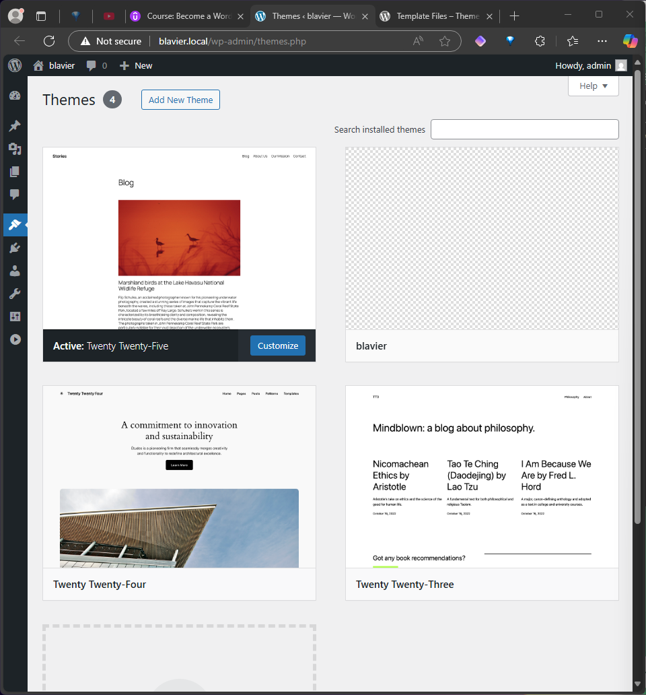

The themes are listed in the wordpress admin pannel at [wp-admin > appearance > themes ](http://blavier.local/wp-admin/themes.php).

The source files of the installed themes are contained in `wp-content\themes` :

```ascii
📦 public/
└─ 📂 wp-content/
   └─ 📂 themes/
      ├─ 📂 twentytwentyfive/
      ├─ 📂 twentytwentyfour/
      └─ 📂 twentytwentythree/
```

To create a new theme:

- Create a new folder in the `themes/` directory
- Add a Stylesheet (`style.css`)
- Add a [Template](https://developer.wordpress.org/themes/basics/template-files/#template-files) in the theme folder (`index.php`)

A blank theme will appear in the Themes page:



In wordpress, the file style.css is used to provide metadata on the theme, using css comments.

```css
/*
    Theme Name: Blavier
    Author: DesignThinkerer
    Version: 1.0.0
*/
```

To add a thumbnail for the theme, add a `image.png` file in the root of the folder theme. 

Next, activate the theme to use it.