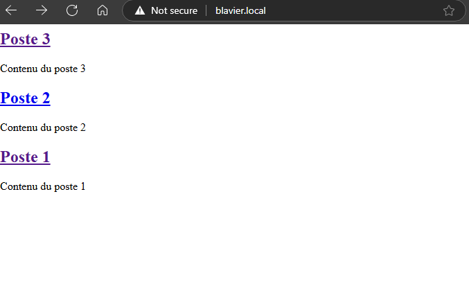
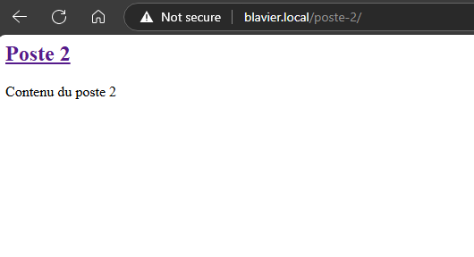

# WordPress Query Functions Overview

WordPress provides a set of predefined functions that simplify querying data from the database. These functions, most notably the Loop, allow you to dynamically display posts and pages with minimal code.

## Posts

Before you begin, ensure that you have created several posts so that WordPress can retrieve data from the database.

### Understanding The Loop

The Loop is a core concept in WordPress that processes and displays posts returned by a query. Two key functions used within the Loop are:

- **`have_posts()`**  
  Checks if there are any posts remaining in the current query. It returns a boolean value (`true` if posts remain, otherwise `false`).

- **`the_post()`**  
  Advances the internal pointer to the next post and sets up the global post data. This makes template tags like `the_permalink()`, `the_title()`, and `the_content()` work correctly for the current post.

### Example Usage

Below is an example of how to implement the Loop in your theme’s template file:

```php
<?php
if ( have_posts() ) :
    while ( have_posts() ) : the_post(); ?>
        <h2>
            <a href="<?php the_permalink(); ?>"><?php the_title(); ?></a>
        </h2>
        <p><?php the_content(); ?></p>
    <?php endwhile;
else : ?>
    <p>No posts found.</p>
<?php endif; ?>
```

In this example:
- **Homepage:** When a user visits your homepage, WordPress runs the main query to retrieve a list of posts and displays each one using the above code.

  

- **Single Post:** When a user clicks on a post permalink, WordPress detects from the URL that a single post view is requested. It then loads the appropriate template, processing and displaying only the selected post.

  

### Creating a Single Post Template

To handle single post views, create a template file named `single.php`. WordPress will use this file instead of `index.php` when displaying a single post. For example:

```php
<?php
if ( have_posts() ) :
    while ( have_posts() ) : the_post(); ?>
        <h1><?php the_title(); ?></h1>
        <p><?php the_content(); ?></p>
    <?php endwhile;
endif;
?>
```

## Pages

WordPress also allows you to create static pages. Similar to posts, you can create custom templates to display pages.

### Creating a Page Template

To customize the display of individual pages, create a template file named `page.php`. WordPress will automatically use this file when a single page is requested.