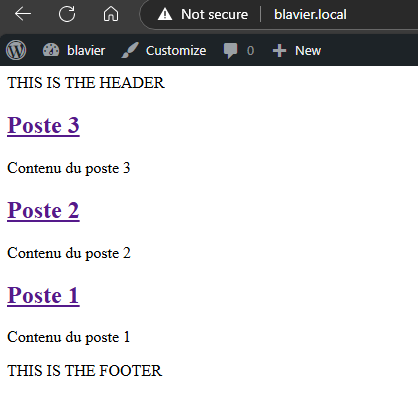

## Using Reusable Header and Footer Templates

To maintain consistency across pages, posts, and other templates, we want to reuse common elements like the header and footer. WordPress allows to define these elements in separate files—`header.php` and `footer.php`—and then include them in the template using `get_header()` and `get_footer()`.

### Header Template (`header.php`)

The `header.php` file should contain everything that appears at the top of the pages, including the `<head>` section. This is also where we call `wp_head()` to allow WordPress and plugins to add necessary metadata, styles, and scripts.

```php
<!DOCTYPE html>
<html lang="en">
<head>
    <?php wp_head(); ?>
</head>
<body>
<header>
    THIS IS THE HEADER
</header>
```

### Footer Template (`footer.php`)

The footer.php file contains the elements that appear at the bottom of the pages. We also call `wp_footer()` in this file to ensure that WordPress and plugins can insert additional scripts or content before the closing `</body>` tag.

```php
<footer>
    THIS IS THE FOOTER
</footer>
<?php wp_footer(); ?>
</body>
</html>
```

### Example of use (`index.php`)

```php
<?php
get_header();

if ( have_posts() ) :
    while ( have_posts() ) : the_post(); ?>
        <h2>
            <a href="<?php the_permalink(); ?>"><?php the_title(); ?></a>
        </h2>
        <p><?php the_content(); ?></p>
    <?php endwhile;
else : ?>
    <p>No posts found.</p>
<?php endif;

get_footer();
```



## Enqueuing Styles via functions.php

To programmatically tell WordPress which styles should be loaded, we create a `functions.php` file. Using `add_action()`, we can hook into WordPress at specific points during its execution and specify the function to run.

### Enqueueing Styles and Scripts

- **Hook:** Use the `wp_enqueue_scripts` action, which is triggered when WordPress loads the content into the `<head>` via `wp_head()`.
- **Functions:**  
  - `wp_enqueue_style()` is used to load a stylesheet.
  - `wp_enqueue_script()` is used to load a JavaScript file. This function accepts additional parameters such as dependencies, version number, and whether the script should be loaded in the footer.

- **Helpers:**  
  - `get_stylesheet_uri()` retrieves the URI of your theme’s `style.css` file.
  - `get_theme_file_uri()` converts a relative path to an absolute URI within your theme.

Here’s an example of how to enqueue multiple styles and scripts:


```php
<?php
add_action('wp_enqueue_scripts', 'action_wp_enqueue_files');

function action_wp_enqueue_files(): void
{
    // Open props
    wp_enqueue_style('open-props', '//unpkg.com/open-props');

    // Beercss
    wp_enqueue_style('beercss', '//cdn.jsdelivr.net/npm/beercss@3.9.7/dist/cdn/beer.min.css');
    wp_enqueue_script('beercss-script', '//cdn.jsdelivr.net/npm/beercss@3.9.7/dist/cdn/beer.min.js', NULL, '3.9.7', true);
    wp_enqueue_script('material-dynamic-colors', '//cdn.jsdelivr.net/npm/material-dynamic-colors@1.1.2/dist/cdn/material-dynamic-colors.min.js', NULL, '1.1.2', true);

    // Typography
    wp_enqueue_style('open-props', get_theme_file_uri('/styles/typetura.css'));

    // Base
    wp_enqueue_style('blavier_base_styles', get_stylesheet_uri());

    // Main
    wp_enqueue_style('blavier_main_styles', get_theme_file_uri('/styles/main.css'));
}
```

This code will:

- Load external resources such as Open Props, BeerCSS, and Material Dynamic Colors from their respective CDNs.
- Enqueue local stylesheets, ensuring that they’re correctly linked to the theme files.