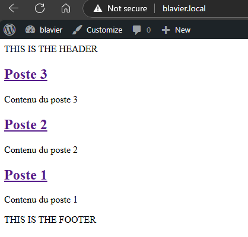

## Using Reusable Header and Footer Templates

To maintain consistency across pages, posts, and other templates, we want to reuse common elements like the header and footer. WordPress allows to define these elements in separate files—`header.php` and `footer.php`—and then include them in the template using `get_header()` and `get_footer()`.

### Header Template (`header.php`)

The `header.php` file should contain everything that appears at the top of the pages, including the `<head>` section. This is also where we call `wp_head()` to allow WordPress and plugins to add necessary metadata, styles, and scripts.

```php
<!DOCTYPE html>
<html lang="en">
<head>
    <?php wp_head(); ?>
</head>
<body>
<header>
    THIS IS THE HEADER
</header>
```

### Footer Template (`footer.php`)

The footer.php file contains the elements that appear at the bottom of the pages. We also call `wp_footer()` in this file to ensure that WordPress and plugins can insert additional scripts or content before the closing `</body>` tag.

```php
<footer>
    THIS IS THE FOOTER
</footer>
<?php wp_footer(); ?>
</body>
</html>
```

### Example of use (`index.php`)

```php
<?php
get_header();

if ( have_posts() ) :
    while ( have_posts() ) : the_post(); ?>
        <h2>
            <a href="<?php the_permalink(); ?>"><?php the_title(); ?></a>
        </h2>
        <p><?php the_content(); ?></p>
    <?php endwhile;
else : ?>
    <p>No posts found.</p>
<?php endif;

get_footer();
```



## Enqueuing Styles via functions.php

To programmatically tell WordPress which styles should be loaded, we create a `functions.php` file. We can use `add_action()` to hook into WordPress at specific points during its execution and pass to wordpress the name of a function to run at that point.

To load a stylesheet, we hook into `wp_enqueue_scripts` (the moment where content is loaded into the head via `wp_head()`) and call `wp_enqueue_style()`. The function `get_stylesheet_uri()` retrieves the URI of our theme’s `style.css` file.

```php
<?php
add_action('wp_enqueue_scripts', 'action_wp_enqueue_files');

function action_wp_enqueue_files() : void {
    wp_enqueue_style('blavier_main_styles',get_stylesheet_uri());
}
```